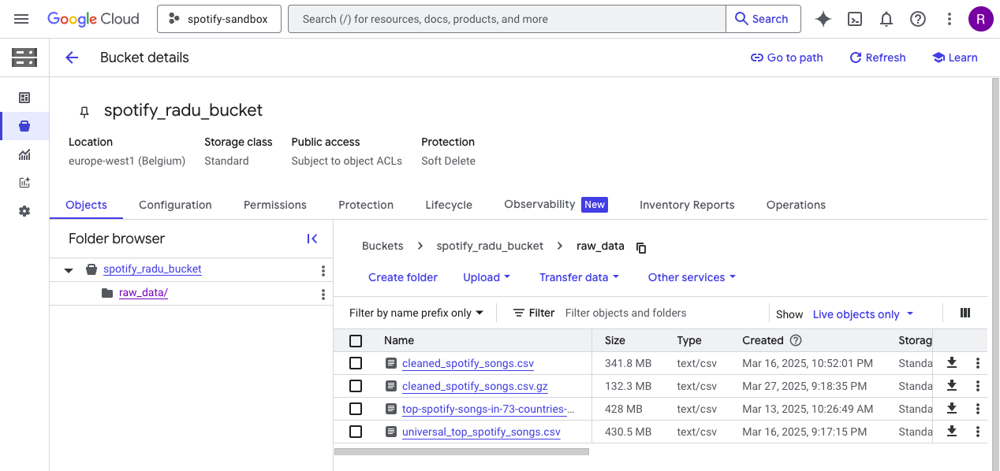
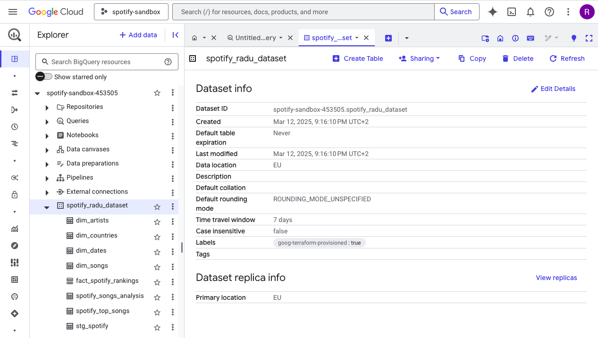
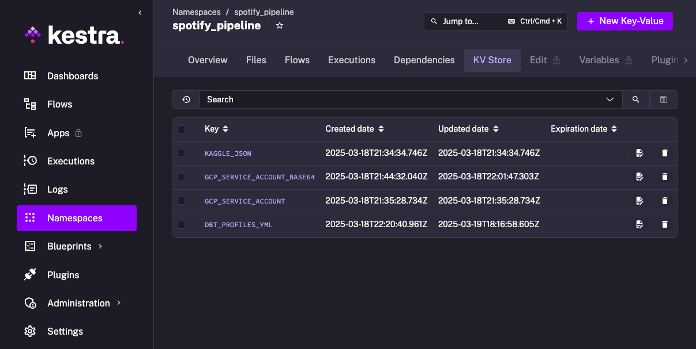
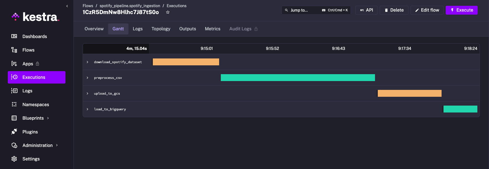
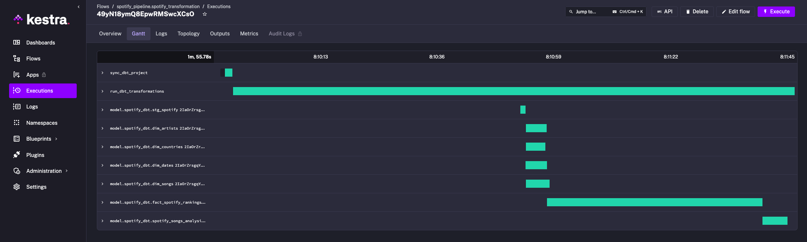
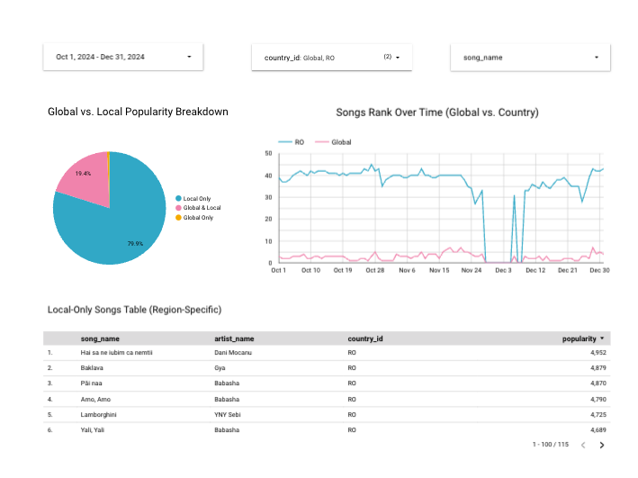

# **🎵 Global vs. Local Music Popularity Analysis**  

## **📌 Project Overview**  
Music streaming platforms like **Spotify** provide rankings for the most popular songs in various countries. Some songs dominate the **global charts**, while others remain **regionally popular**. However, there is no straightforward way to compare a song’s **international success** with its **local popularity** over time.  
  
This project builds an **end-to-end batch data pipeline** to analyze and visualize how **song rankings differ between global and country-specific charts**
  

### **Key Insights Provided by This Project:**
✅ **Which songs are globally recognized vs. locally popular?**  
✅ **How do song rankings change over time across different regions?**  
✅ **Which songs are exclusive to local charts and which succeed globally?**
  
The final dashboard visualizes trends, comparisons, and song-level insights by combining transformed data from multiple sources into a single reporting table.

---

## **🛠️ Technologies Used**  

| **Component**              | **Technology**            | **Purpose**                                  |
|----------------------------|----------------------------|----------------------------------------------|
| **Cloud Platform**         | GCP (Google Cloud Platform) | Hosting all infrastructure and services       |
| **Infrastructure as Code (IaC)** | Terraform               | Provisioning cloud resources                  |
| **Workflow Orchestration** | Kestra                    | Automating batch data ingestion               |
| **Data Storage (Datalake)** | Google Cloud Storage (GCS) | Storing raw Spotify data                      |
| **Data Warehouse**         | BigQuery                  | Storing, partitioning, and querying data      |
| **Data Transformation**    | dbt                       | Cleaning and preparing data for analysis      |
| **Visualization & Dashboard** | Looker Studio           | Creating interactive reports                  |

Each of these tools is chosen to ensure **scalability, automation, and reproducibility** in handling large datasets efficiently.

### **📥 Data Extraction with Kaggle API**  
This project uses the **Kaggle API** to download the dataset directly from Kaggle. The API allows automated and reproducible data extraction without manual downloads.  

---

## **📂 Dataset: Spotify Top 50 Songs in 73 Countries**  

The dataset used in this project is publicly available on Kaggle:  
🔗 [Top Spotify Songs in 73 Countries (Daily Updated)](https://www.kaggle.com/datasets/asaniczka/top-spotify-songs-in-73-countries-daily-updated/)  

### **Dataset Description**  
This dataset contains **daily updated rankings of the top 50 Spotify songs** across 73 countries, including **global rankings**. Key attributes include:

| **Column**          | **Description** |
|--------------------|------------------------------|
| `spotify_id` | Unique identifier for the song |
| `name` | Song title |
| `artists` | Artist(s) associated with the song |
| `daily_rank` | The song's position in the top 50 for a specific day |
| `daily_movement` | Rank change compared to the previous day |
| `weekly_movement` | Rank change compared to the previous week |
| `country` | Country of the ranking (or "Global" for worldwide charts) |
| `snapshot_date` | The date of the ranking |
| `popularity` | A numerical measure of song popularity |
| `is_explicit` | Indicates whether the song has explicit lyrics |
| `duration_ms` | Length of the song in milliseconds |
| `danceability`, `energy`, `valence`, `tempo`, etc. | Audio features describing the song’s characteristics |

This dataset allows us to compare **global vs. local song rankings** over time and analyze trends in different regions.

---

## **📊 Dashboard Overview**  

The final dashboard (built in **Looker Studio**) contains **three key visualizations**, designed to answer the central questions of this project:

1️⃣ **Categorical Graph:** **Distribution of Songs in Global vs. Local Charts**  
   - Compares the number of songs that appear **only in global**, **only in local**, or **in both** types of charts.  
   - Helps identify which songs are **international hits** vs. **regionally popular**.  

2️⃣ **Time-Series Graph:** **Songs Rank Over Time (Global vs. Country)**  
   - Illustrates how a song's ranking evolves over time across different regions.
   - Useful for spotting trends in song rotation and chart volatility.  
 
3️⃣ **Exploratory Table:** **Local-Only Songs Overview**  
   - Displays songs that only appear in local charts, filtered by region and timeframe.  
   - Helps highlight regional preferences and emerging local artists.

---

## **🚀 Getting Started**  
This section will guide users on how to set up and run the project.

### **🔧 Prerequisites**
Ensure you have the following installed:
- **Google Cloud SDK**
- **Terraform**
- **Kestra**
- **dbt**
- **Looker Studio (Google Account required)**

## **💻 Setup Instructions**

### **🛠 Setting Up Terraform**

#### **Pre-requisites:**
Before proceeding, ensure the following steps are completed:
- **Create a GCP project**: `spotify-sandbox`
- **Set up a service account** with the following roles:
  - Storage Admin
  - BigQuery Admin
  - Compute Admin
- **Download the JSON key file** and store it securely (e.g., in the `keys/` directory).

---

#### **1. Ensure Terraform is Installed**
- If Terraform is not installed, download it from [Terraform's official site](https://developer.hashicorp.com/terraform/downloads).
- Verify installation:
  ```bash
  terraform -v
     ```

2. **Navigate to the Terraform Directory**
   ```bash
   cd spotify_pipeline/terraform
   ```

3. **Create and Configure Terraform Files**
    - main.tf → Defines infrastructure resources (e.g., GCS bucket, BigQuery dataset).
```
terraform {
  required_providers {
    google = {
      source  = "hashicorp/google"
      version = "6.16.0"
    }
  }
}

provider "google" {
  credentials = file(var.credentials_file)
  project     = var.project_id
  region      = var.region
}

resource "google_storage_bucket" "spotify_radu_bucket" {
  name          = var.gcs_bucket_name
  location      = var.region
  force_destroy = true

  lifecycle_rule {
    action {
      type = "Delete"
    }
    condition {
      age = 60 # Delete files older than 60 days
    }
  }
}

resource "google_bigquery_dataset" "spotify_radu_dataset" {
  dataset_id  = var.bq_dataset_name
  project     = var.project_id
  location    = var.location
}

resource "google_bigquery_table" "spotify_songs" {
  dataset_id = google_bigquery_dataset.spotify_radu_dataset.dataset_id
  table_id   = var.bigquery_table_id
  project    = var.project_id
  schema     = var.bigquery_table_schema
}
```
  - variables.tf → Stores reusable values (e.g., project ID, bucket name, region).
```
variable "credentials_file" {
  description = "Path to the GCP Service Account Key JSON file"
  default     = "../keys/project.json"
}

variable "project_id" {
  description = "Google Cloud Project ID"
  default     = "spotify-sandbox-453505"
}

variable "region" {
  description = "GCP Region for resource deployment"
  default     = "europe-west1" 
}

variable "location" {
  description = "Location for BigQuery dataset (use 'EU' for multi-region)"
  default     = "EU"
}

variable "bq_dataset_name" {
  description = "Name of the BigQuery dataset for storing processed data"
  default     = "spotify_radu_dataset" 
}

variable "gcs_bucket_name" {
  description = "Name of the GCS bucket for raw data storage"
  default     = "spotify_radu_bucket"
}

variable "gcs_storage_class" {
  description = "Storage class for GCS bucket (STANDARD, NEARLINE, COLDLINE, ARCHIVE)"
  default     = "STANDARD"
}

variable "bigquery_table_id" {
  description = "Table ID for the BigQuery table"
  default     = "spotify_top_songs"
}

variable "bigquery_table_schema" {
  description = "Schema for the BigQuery table"
  default = <<EOF
[
  {"name": "spotify_id", "type": "STRING", "mode": "REQUIRED"},
  {"name": "name", "type": "STRING", "mode": "REQUIRED"},
  {"name": "artists", "type": "STRING", "mode": "REQUIRED"}, 
  {"name": "daily_rank", "type": "INTEGER", "mode": "REQUIRED"},
  {"name": "daily_movement", "type": "INTEGER", "mode": "NULLABLE"},
  {"name": "weekly_movement", "type": "INTEGER", "mode": "NULLABLE"},
  {"name": "country", "type": "STRING", "mode": "NULLABLE"},
  {"name": "snapshot_date", "type": "DATE", "mode": "REQUIRED"},
  {"name": "popularity", "type": "INTEGER", "mode": "NULLABLE"},
  {"name": "is_explicit", "type": "BOOLEAN", "mode": "NULLABLE"},
  {"name": "duration_ms", "type": "INTEGER", "mode": "NULLABLE"},
  {"name": "album_name", "type": "STRING", "mode": "NULLABLE"},
  {"name": "album_release_date", "type": "DATE", "mode": "NULLABLE"},
  {"name": "danceability", "type": "FLOAT", "mode": "NULLABLE"},
  {"name": "energy", "type": "FLOAT", "mode": "NULLABLE"},
  {"name": "key", "type": "INTEGER", "mode": "NULLABLE"},
  {"name": "loudness", "type": "FLOAT", "mode": "NULLABLE"},
  {"name": "mode", "type": "INTEGER", "mode": "NULLABLE"},
  {"name": "speechiness", "type": "FLOAT", "mode": "NULLABLE"},
  {"name": "acousticness", "type": "FLOAT", "mode": "NULLABLE"},
  {"name": "instrumentalness", "type": "FLOAT", "mode": "NULLABLE"},
  {"name": "liveness", "type": "FLOAT", "mode": "NULLABLE"},
  {"name": "valence", "type": "FLOAT", "mode": "NULLABLE"},
  {"name": "tempo", "type": "FLOAT", "mode": "NULLABLE"},
  {"name": "time_signature", "type": "INTEGER", "mode": "NULLABLE"}
]
EOF
}
```

4. **Initialize Terraform** (only needed for the first time):
   ```bash
   terraform init
   ```
    - This downloads the required Google provider and sets up the working directory.

5. **Validate and Preview Terraform Changes**:
   ```bash
   terraform plan
   ```
   - This checks for any errors and previews what Terraform will create.

6. **Apply Terraform to Create Resources**:
   ```bash
   terraform apply
   ```
   - Type **yes** when prompted to confirm resource creation.

7. **Verify the Created Resources**:
   - **Check the GCS bucket:**
     ```bash
     gcloud storage buckets list
     ```
   - **Check the BigQuery dataset:**
     ```bash
     bq ls
     ```

### **📥 Setting Up Kaggle API**  
1. Install the Kaggle API package if you haven't already:  
   ```bash
   pip install kaggle
   ```  
2. Authenticate by placing your Kaggle API key (`kaggle.json`) in the correct directory:  
   ```bash
   mkdir -p ~/.kaggle
   mv kaggle.json ~/.kaggle/
   chmod 600 ~/.kaggle/kaggle.json
   ```  
3. Download the dataset using the Kaggle API:  
   ```bash
   kaggle datasets download -d asaniczka/top-spotify-songs-in-73-countries-daily-updated -p data/
   ```  
4. Unzip the dataset:  
   ```bash
   unzip top-spotify-songs-in-73-countries-daily-updated.zip -d data/
   ```

### **Upload the Dataset to GCS**  
1. Before uploading, make sure you have set up Google Cloud authentication:  
```bash  
export GOOGLE_APPLICATION_CREDENTIALS="keys/project.json"  
```  
2. Now, upload the dataset to your Google Cloud Storage (GCS) bucket:  
```bash  
gsutil cp data/universal_top_spotify_songs.csv gs://spotify_radu_bucket/raw_data/  
```  
3. After uploading, confirm that the file is in your bucket:  
```bash  
gsutil ls gs://spotify_radu_bucket/raw_data/  
```  
4. Expected output:  
```  
gs://spotify_radu_bucket/raw_data/universal_top_spotify_songs.csv  
```  



### **📀 Loading Data into BigQuery**

1. Verify the File in GCS
Before loading the data, ensure that the file is correctly stored in your GCS bucket.
```
gsutil ls gs://spotify_radu_bucket/raw_data/
```
2. Define the BigQuery Table Schema in Terraform
Inside terraform/variables.tf, ensure the schema is properly stored as a variable:
```
variable "bigquery_table_id" {
  description = "Table ID for the BigQuery table"
  default     = "spotify_top_songs"
}

variable "bigquery_table_schema" {
  description = "Schema for the BigQuery table"
  default = <<EOF
[
  {"name": "spotify_id", "type": "STRING", "mode": "REQUIRED"},
  {"name": "name", "type": "STRING", "mode": "REQUIRED"},
  {"name": "artists", "type": "STRING", "mode": "REQUIRED"}, 
  {"name": "daily_rank", "type": "INTEGER", "mode": "REQUIRED"},
  {"name": "daily_movement", "type": "INTEGER", "mode": "NULLABLE"},
  {"name": "weekly_movement", "type": "INTEGER", "mode": "NULLABLE"},
  {"name": "country", "type": "STRING", "mode": "NULLABLE"},
  {"name": "snapshot_date", "type": "DATE", "mode": "REQUIRED"},
  {"name": "popularity", "type": "INTEGER", "mode": "NULLABLE"},
  {"name": "is_explicit", "type": "BOOLEAN", "mode": "NULLABLE"},
  {"name": "duration_ms", "type": "INTEGER", "mode": "NULLABLE"},
  {"name": "album_name", "type": "STRING", "mode": "NULLABLE"},
  {"name": "album_release_date", "type": "DATE", "mode": "NULLABLE"},
  {"name": "danceability", "type": "FLOAT", "mode": "NULLABLE"},
  {"name": "energy", "type": "FLOAT", "mode": "NULLABLE"},
  {"name": "key", "type": "INTEGER", "mode": "NULLABLE"},
  {"name": "loudness", "type": "FLOAT", "mode": "NULLABLE"},
  {"name": "mode", "type": "INTEGER", "mode": "NULLABLE"},
  {"name": "speechiness", "type": "FLOAT", "mode": "NULLABLE"},
  {"name": "acousticness", "type": "FLOAT", "mode": "NULLABLE"},
  {"name": "instrumentalness", "type": "FLOAT", "mode": "NULLABLE"},
  {"name": "liveness", "type": "FLOAT", "mode": "NULLABLE"},
  {"name": "valence", "type": "FLOAT", "mode": "NULLABLE"},
  {"name": "tempo", "type": "FLOAT", "mode": "NULLABLE"},
  {"name": "time_signature", "type": "INTEGER", "mode": "NULLABLE"}
]
EOF
}
```
3. Define BigQuery Table in Terraform
Inside terraform/main.tf, ensure the table creation is defined using the variables:
```
resource "google_bigquery_table" "spotify_songs" {
  dataset_id = google_bigquery_dataset.spotify_radu_dataset.dataset_id
  table_id   = var.bigquery_table_id
  project    = var.project_id
  schema     = var.bigquery_table_schema
}
```
4. Apply Terraform Changes
After adding the table definition, run Terraform to create the table in BigQuery:
```bash
cd terraform
terraform init  # If not already initialized
terraform plan
terraform apply
```
5. Verify That the Table Was Created
Run:
```bash
bq ls spotify_radu_dataset
```
6. Load Data from GCS into BigQuery
Now that we have the table created, we can load the data from GCS:
```bash
bq load \
  --source_format=CSV \
  --skip_leading_rows=1 \
  spotify-sandbox-453505:spotify_radu_dataset.spotify_top_songs \
  gs://spotify_radu_bucket/raw_data/universal_top_spotify_songs.csv
```
7. Verify Data in BigQuery
Run:
```bash
bq query --nouse_legacy_sql \
'SELECT * FROM `spotify-sandbox-453505.spotify_radu_dataset.spotify_top_songs` LIMIT 10'
```



### **🚀 Automating Data Ingestion with Kestra**  
Now that the data is successfully loaded into **BigQuery**, the next step is to **automate the data pipeline** so that new data is **extracted, uploaded, and ingested into BigQuery** automatically.  

We will use **Kestra**, a powerful workflow orchestration tool, to automate this process.

---

### **✅ Overview of the Automated Workflow**  
Using **Kestra**, we will create a **scheduled pipeline** that performs the following steps:

- **Extract** data from Kaggle using the **Kaggle API**  
- **Upload** the dataset to **Google Cloud Storage (GCS)**  
- **Load** data from GCS into **BigQuery**  
- **Schedule** the workflow to run automatically (e.g., daily)  

---

### **📌 Steps to Set Up Kestra for Automation**

### **1️⃣ Install & Run Kestra**  
We have 2 options here: 
- Run Kestra with GCP VM: [Kestra install](https://kestra.io/docs/installation/gcp-vm?utm_source=YouTube&utm_medium=Video&utm_campaign=Description&utm_content=GCP&clid=eyJpIjoib0FFSWl6cVQ3MUNNOU44S0QzRFppIiwiaCI6IiIsInAiOiIvaW5zdGFsbC9nY3AiLCJ0IjoxNzQzNDQ3MTA5fQ._Qua2bldA3wo_6Az81cC5DvwLfcLT57DXIA0KgEKpio)

- Run Kestra locally - easy to reproduce:

To run Kestra locally, you need **Docker**. If Docker is not installed, install it using:

- **For macOS (using Homebrew):**  
  ```bash  
  brew install --cask docker  
  ```  
- **For Ubuntu/Linux:**  
  ```bash  
  sudo apt update && sudo apt install docker.io -y  
  ```  

Once Docker is installed, start Kestra using:
```bash  
docker run --pull=always --rm -it -p 8080:8080 --user=root -v /var/run/docker.sock:/var/run/docker.sock -v /tmp:/tmp kestra/kestra:latest server local  
```
- Kestra will be available at **`http://localhost:8080/`**
- Open this URL in your browser.

---

### **2️⃣ Configure Kestra Web Interface**  
Once Kestra is running at **http://localhost:8080/** (or external IP:8080), follow these steps to set up credentials and create the ingestion flow:

#### **Step 1: Add Kaggle and GCP Credentials to KV Store**  
Kestra requires credentials to interact with Kaggle and Google Cloud. Add them securely to the **Kestra KV Store**:

1. Navigate to **http://localhost:8080/** (or external IP:8080)
2. Go to **Namespaces → spotify_pipeline → KV Store**
3. Add the following entries:
   - **Key:** `KAGGLE_JSON` → Paste the content of your `kaggle.json` file.
   - **Key:** `GCP_SERVICE_ACCOUNT_BASE64` → Convert your GCP service account JSON file to Base64 and paste it:
     ```bash
     base64 keys/project.json
     ```
   - **Key:** `GCP_SERVICE_ACCOUNT` → Paste the full content of `project.json` (without encoding).



#### **Step 2: Create a New Flow in Kestra**  
1. In Kestra UI, go to **Flows → Create Flow**
2. Name it **spotify_ingestion**
3. Paste the following YAML code:
    ```yaml
    id: spotify_ingestion  
    namespace: spotify_pipeline
    description: "Automated pipeline: Download Spotify dataset from Kaggle, preprocess it, upload to GCS, and load into BigQuery."

    tasks:
    - id: download_spotify_dataset
        type: "io.kestra.plugin.scripts.shell.Commands"
        description: "Download the latest Spotify dataset from Kaggle."
        containerImage: "python:3.9"
        outputFiles:
        - "universal_top_spotify_songs.csv"
        env:
        KAGGLE_CONFIG_DIR: "/root/.kaggle"
        beforeCommands:
        - "pip install --no-cache-dir kaggle"
        commands:
        - "mkdir -p $KAGGLE_CONFIG_DIR"
        - "echo '{{ kv('KAGGLE_JSON') | toJson }}' > $KAGGLE_CONFIG_DIR/kaggle.json"
        - "chmod 600 $KAGGLE_CONFIG_DIR/kaggle.json"
        - "kaggle datasets download -d asaniczka/top-spotify-songs-in-73-countries-daily-updated -p ./ --force"
        - "unzip -o ./top-spotify-songs-in-73-countries-daily-updated.zip -d ./"
        - "ls -lh ./"
        - "[ -f ./universal_top_spotify_songs.csv ] && echo '✅ File exists!' || { echo '❌ ERROR: File not found!'; exit 1; }"

    - id: preprocess_csv
        type: "io.kestra.plugin.scripts.python.Commands"
        description: "Preprocess CSV to ensure empty values are recognized as NULL by BigQuery."
        containerImage: "python:3.9"
        outputFiles:
        - "cleaned_spotify_songs.csv.gz"
        beforeCommands:
        - "pip install pandas"
        commands:
        - |
            python - <<EOF
            import os
            import pandas as pd

            csv_file = "{{ outputs.download_spotify_dataset.outputFiles['universal_top_spotify_songs.csv'] }}"
            if not os.path.exists(csv_file):
                raise FileNotFoundError(f"❌ ERROR: {csv_file} not found!")
            
            print(f"✅ Found CSV file: {csv_file}")

            # Load CSV with proper encoding
            df = pd.read_csv(csv_file, encoding='utf-8')

            # Standardize empty values to NULL (handles spaces, tabs, and invisible characters)
            df = df.map(lambda x: None if isinstance(x, str) and x.strip() == "" else x)

            # Drop rows with missing required values
            required_columns = ["name", "spotify_id"]
            df.dropna(subset=required_columns, inplace=True)

            # Save as compressed CSV
            output_file = "cleaned_spotify_songs.csv.gz"
            df.to_csv(output_file, index=False, encoding='utf-8-sig', compression='gzip')

            print(f"✅ Processed CSV saved as: {output_file}")
            EOF

    - id: upload_to_gcs
        type: "io.kestra.plugin.scripts.shell.Commands"
        description: "Upload the cleaned dataset to Google Cloud Storage."
        containerImage: "google/cloud-sdk:latest"
        env:
        GOOGLE_APPLICATION_CREDENTIALS: "/tmp/gcp-key.json"
        commands:
        - "echo '{{ kv('GCP_SERVICE_ACCOUNT_BASE64') }}' | base64 -d > $GOOGLE_APPLICATION_CREDENTIALS"
        - "chmod 600 $GOOGLE_APPLICATION_CREDENTIALS"
        - "gcloud auth activate-service-account --key-file=$GOOGLE_APPLICATION_CREDENTIALS"
        - "gcloud auth list"
        - "FILE_PATH={{ outputs.preprocess_csv.outputFiles['cleaned_spotify_songs.csv.gz'] }}"
        - "ls -lh $FILE_PATH || { echo '❌ ERROR: File not found!'; exit 1; }"
        - "gsutil -o 'GSUtil:parallel_composite_upload_threshold=100M' -h 'Content-Type:text/csv' -h 'Content-Encoding:gzip' cp $FILE_PATH gs://spotify_radu_bucket/raw_data/cleaned_spotify_songs.csv.gz"
        - "echo '✅ Upload complete!'"

    - id: load_to_bigquery
        type: io.kestra.plugin.gcp.bigquery.LoadFromGcs
        description: "Load the cleaned dataset into BigQuery."
        serviceAccount: "{{ kv('GCP_SERVICE_ACCOUNT') }}"
        projectId: "spotify-sandbox-453505"
        from:
        - "gs://spotify_radu_bucket/raw_data/cleaned_spotify_songs.csv.gz"
        destinationTable: "spotify-sandbox-453505.spotify_radu_dataset.spotify_top_songs"
        format: CSV
        csvOptions:
        skipLeadingRows: 1
        allowJaggedRows: true
        encoding: UTF-8
        fieldDelimiter: ","
        quote: '"'
        writeDisposition: WRITE_TRUNCATE
        schema:
        fields:
            - name: spotify_id
            type: STRING
            mode: REQUIRED
            - name: name
            type: STRING
            mode: REQUIRED
            - name: artists
            type: STRING
            mode: REQUIRED
            - name: daily_rank
            type: INT64
            mode: REQUIRED
            - name: daily_movement
            type: INT64
            mode: NULLABLE
            - name: weekly_movement
            type: INT64
            mode: NULLABLE
            - name: country
            type: STRING
            mode: NULLABLE
            - name: snapshot_date
            type: DATE
            mode: REQUIRED
            - name: popularity
            type: INT64
            mode: NULLABLE
            - name: is_explicit
            type: BOOL
            mode: NULLABLE
            - name: duration_ms
            type: INT64
            mode: NULLABLE
            - name: album_name
            type: STRING
            mode: NULLABLE
            - name: album_release_date
            type: DATE
            mode: NULLABLE
            - name: danceability
            type: FLOAT64
            mode: NULLABLE
            - name: energy
            type: FLOAT64
            mode: NULLABLE
            - name: key
            type: INT64
            mode: NULLABLE
            - name: loudness
            type: FLOAT64
            mode: NULLABLE
            - name: mode
            type: INT64
            mode: NULLABLE
            - name: speechiness
            type: FLOAT64
            mode: NULLABLE
            - name: acousticness
            type: FLOAT64
            mode: NULLABLE
            - name: instrumentalness
            type: FLOAT64
            mode: NULLABLE
            - name: liveness
            type: FLOAT64
            mode: NULLABLE
            - name: valence
            type: FLOAT64
            mode: NULLABLE
            - name: tempo
            type: FLOAT64
            mode: NULLABLE
            - name: time_signature
            type: INT64
            mode: NULLABLE
        autodetect: false

    triggers:
    - id: daily_schedule
        type: io.kestra.plugin.core.trigger.Schedule
        cron: "0 0 * * *"
    ```
4. Save and Deploy the flow.



- orange - passed with warnings
- green - passed without warnings
---

### **3️⃣ Schedule the Workflow (Daily Execution)**
To run this flow automatically every day, update `spotify_ingestion.yaml` by adding:
```yaml
triggers:
  - id: daily_schedule
    type: io.kestra.core.models.triggers.types.Schedule
    cron: "0 0 * * *"  # Runs every day at 00:00 AM UTC
```
- Uses **Cron syntax** (`0 0 * * *` → Every day at **0:00 AM UTC**).

## 🚀 Automating Data Transformations with dbt
Now that the data is successfully loaded into **BigQuery**, the next step is to **clean, structure, and optimize it for analysis using dbt**.

We will use **dbt (Data Build Tool)** to transform raw Spotify data into a structured format for efficient querying and dashboard visualization.

## ✅ Overview of the dbt Workflow
Using **dbt**, we will:

1. **Set up dbt and configure it to work with BigQuery**  
2. **Create models to clean and transform raw Spotify data**  
3. **Schedule dbt to run automatically every day at 01:00 UTC**  

## 📌 Steps to Set Up dbt for Transformations

### 1️⃣ Install & Configure dbt
#### Step 1: Install dbt
 - **For macOS (Homebrew):**
  ```bash
  brew install dbt-bigquery
  ```
 - **For Ubuntu/Linux (via pip):**
  ```bash
  pip install dbt-bigquery
  ```

Verify installation:
```bash
dbt --version
```

### 2️⃣ Initialize dbt Project
Navigate to your project directory and create a new dbt project:
```bash
cd spotify_pipeline
dbt init spotify_dbt
```
 - This creates a `spotify_dbt/` folder inside the project.

### 3️⃣ Check dbt configuration for BigQuery
1. Check `~/.dbt/profiles.yml` (create it if it doesn’t exist):
   ```bash
   cat ~/.dbt/profiles.yml
   ```
2. Profiles configuration:
    ```yaml
    spotify_dbt:
      outputs:
        dev:
          dataset: spotify_radu_dataset
          job_execution_timeout_seconds: 300
          job_retries: 1
          keyfile: /Users/radu.stroe/Documents/spotify_pipeline/keys/project.json
          location: EU
          method: service-account
          priority: interactive
          project: spotify-sandbox-453505
          threads: 4
          type: bigquery
      target: dev
    ```

3. Test the connection:
Navigate to your dbt project:
    ```bash
    cd spotify_dbt
    ```
Verify dbt configuration:
   ```bash
   dbt debug
   ```
✅ If successful, dbt is now connected to BigQuery.

### 4️⃣ Create dbt Models for Transformations

1. Create a folder for **staging models**:

```bash
mkdir -p models/staging
```

2. Create a staging model:
```sql
{{ config(
    materialized='table',
    cluster_by=["spotify_id", "snapshot_date"]
) }}

WITH ranked_spotify AS (
    SELECT
        spotify_id,
        name,
        TRIM(SPLIT(artists, ',')[OFFSET(0)]) AS artist_name,
        artists AS full_artists,
        COALESCE(country, 'Global') AS country,
        snapshot_date,
        daily_rank,
        daily_movement,
        weekly_movement,
        popularity,
        is_explicit,
        duration_ms,
        album_name,
        album_release_date,
        danceability,
        energy,
        key,
        loudness,
        mode,
        speechiness,
        acousticness,
        instrumentalness,
        liveness,
        valence,
        tempo,
        time_signature,
        ROW_NUMBER() OVER (
            PARTITION BY spotify_id, snapshot_date
            ORDER BY daily_rank ASC, country ASC
        ) AS rank_order
    FROM `spotify-sandbox-453505.spotify_radu_dataset.spotify_top_songs`
)

SELECT *
FROM ranked_spotify
WHERE rank_order = 1  
```
- **Partitioning** → ❌ Not necessary, can be skipped for performance
- **Cluster by**: spotify_id, snapshot_date → quick filtering/debugging a specific song's history
- Use of ROW_NUMBER(): De-duplicate songs per day (snapshot_date) based on best daily_rank.
- COALESCE(country, 'Global'): Smart defaulting of null country to "Global" – helps with grouping.
- Aliased CTE (ranked_spotify): Makes the query organized and modular.
- Filtering by rank_order = 1: Get the “top-ranked unique song per day”.

Create a schema for staging model and add tests: 
```yaml
version: 2

models:
  - name: stg_spotify
    description: "Staging model for Spotify song rankings, including country/global classification."
    columns:
      - name: stg_spotify
        description: "Staging table for Spotify daily rankings"
        tests:
          - unique:
              column_name: "(spotify_id, snapshot_date)"
          - not_null
      - name: name
        description: "Title of the song."
        tests:
          - not_null
      - name: artists
        description: "Artists performing the song."
        tests:
          - not_null
      - name: daily_rank
        description: "Song's rank on the given snapshot date."
        tests:
          - not_null
      - name: daily_movement
        description: "Change in rank compared to the previous day."
      - name: weekly_movement
        description: "Change in rank compared to the previous week."
      - name: country
        description: "Country of the ranking; 'Global' if null."
      - name: snapshot_date
        description: "Date of the ranking snapshot."
        tests:
          - not_null
      - name: popularity
        description: "Popularity score of the song."
      - name: is_explicit
        description: "Indicates whether the song contains explicit lyrics."
      - name: duration_ms
        description: "Duration of the song in milliseconds."
      - name: album_name
        description: "Name of the album the song belongs to."
      - name: album_release_date
        description: "Release date of the album."
      - name: danceability
        description: "A measure of how suitable the song is for dancing."
      - name: energy
        description: "A measure of the intensity of the song."
      - name: key
        description: "The key of the song."
      - name: loudness
        description: "The overall loudness of the song in decibels."
      - name: mode
        description: "Indicates whether the song is in a major or minor key."
      - name: speechiness
        description: "A measure of the presence of spoken words in the song."
      - name: acousticness
        description: "A measure of the acoustic quality of the song."
      - name: instrumentalness
        description: "A measure of the likelihood that the song does not contain vocals."
      - name: liveness
        description: "A measure of the presence of a live audience in the recording."
      - name: valence
        description: "A measure of the musical positiveness conveyed by the song."
      - name: tempo
        description: "The tempo of the song in beats per minute."
      - name: time_signature
        description: "The estimated overall time signature of the song."
```

3. Create a folder for **dim models**:

```bash
mkdir -p models/dim
```

4. Create a dim artists model:

```sql
{{ config(materialized='table') }}

WITH artists AS (
    SELECT DISTINCT
        artist_name,
        TO_HEX(MD5(artist_name)) AS artist_id
    FROM {{ ref('stg_spotify') }}
)

SELECT * FROM artists
```
- **Partitioning/Clustering** → ❌ Small and static - adding partitions or clusters adds overhead without benefit
- Generate unique identifiers without relying on source system IDs
- Normalize and clean data for downstream use

5. Create a dim countries model:

```sql
{{ config(materialized='table') }}

WITH countries AS (
    SELECT DISTINCT
        COALESCE(country, 'Global') AS country_id
    FROM {{ ref('stg_spotify') }}
)

SELECT * FROM countries
```
- **Partitioning/Clustering** → ❌ Small and static - adding partitions or clusters adds overhead without benefit
- If country is NULL, it gets replaced with "Global" using COALESCE().
- This standardizes the dataset and avoids nulls downstream.
- The result is a single-column list of countries (with "Global" included).

6. Create a dim dates model:

```sql
{{ config(materialized='table') }}

WITH dates AS (
    SELECT DISTINCT
        snapshot_date AS date_id,
        EXTRACT(YEAR FROM snapshot_date) AS year,
        EXTRACT(MONTH FROM snapshot_date) AS month,
        EXTRACT(DAY FROM snapshot_date) AS day,
        FORMAT_DATE('%A', snapshot_date) AS day_of_week
    FROM {{ ref('stg_spotify') }}
)

SELECT * FROM dates
```
- **Partitioning/Clustering** → ❌ Small and static - adding partitions or clusters adds overhead without benefit
- Filter dashboards by year, month, weekday
- Useful for derived metrics (like week start/end, quarters, holidays)

7. Create a dim songs model:

```sql
{{ config(materialized='table') }}

WITH ranked_songs AS (
    SELECT
        spotify_id,
        name AS song_name,
        album_name,
        album_release_date,
        danceability,
        energy,
        key,
        loudness,
        mode,
        speechiness,
        acousticness,
        instrumentalness,
        liveness,
        valence,
        tempo,
        time_signature,
        snapshot_date,
        ROW_NUMBER() OVER (PARTITION BY spotify_id ORDER BY snapshot_date DESC) AS row_num 
    FROM {{ ref('stg_spotify') }}
)

SELECT
    spotify_id,
    song_name,
    album_name,
    album_release_date,
    danceability,
    energy,
    key,
    loudness,
    mode,
    speechiness,
    acousticness,
    instrumentalness,
    liveness,
    valence,
    tempo,
    time_signature
FROM ranked_songs
WHERE row_num = 1  
```
- **Partitioning/Clustering** → ❌ Small and static - adding partitions or clusters adds overhead without benefit
- Most recent record for each spotify_id based on snapshot_date
- ROW_NUMBER() ensures the latest snapshot (useful if features evolve over time)
- ORDER BY snapshot_date DESC ranks most recent row first

8. Create a schema for dim models and add tests: 

```yaml
version: 2

models:
  - name: dim_songs
    description: "Contains unique songs with their metadata."
    columns:
      - name: spotify_id
        description: "Unique identifier for the song."
        tests:
          - unique
          - not_null
  - name: dim_artists
    description: "Contains unique artists with hashed IDs."
    columns:
      - name: artist_id
        description: "Hashed unique identifier for the artist."
        tests:
          - unique
          - not_null
  - name: dim_countries
    description: "Contains unique country names, with 'Global' as a fallback."
    columns:
      - name: country_id
        description: "Unique identifier for the country."
        tests:
          - unique
          - not_null
  - name: dim_dates
    description: "Contains date information for time-based queries."
    columns:
      - name: date_id
        description: "The date identifier."
        tests:
          - unique
          - not_null
```

9. Create a folder for **fact models**:

```bash
mkdir -p models/fact
```

10. Create a fact spotify rankings model:

```sql
{{ config(
    materialized='table',
    unique_key='spotify_id',
    partition_by={"field": "date_id", "data_type": "DATE"},
    cluster_by=["country_id"]
) }}

WITH rankings AS (
    SELECT
        s.spotify_id,
        a.artist_id,
        c.country_id,
        d.date_id,
        s.daily_rank,
        s.daily_movement,
        s.weekly_movement,
        s.popularity,
        s.is_explicit,
        s.duration_ms
    FROM {{ ref('stg_spotify') }} s
    LEFT JOIN {{ ref('dim_artists') }} a ON s.artist_name = a.artist_name
    LEFT JOIN {{ ref('dim_countries') }} c ON s.country = c.country_id
    LEFT JOIN {{ ref('dim_dates') }} d ON s.snapshot_date = d.date_id
    
    WHERE s.snapshot_date > (SELECT MAX(date_id) FROM {{ this }})
    
)

SELECT * FROM rankings
```
- **Partition by**: date_id - Reduces the amount of data scanned when querying specific time periods
- **Cluster by**: country_id - Help when filtering by country in dashboards and aggregations
- Sources data from stg_spotify: cleaned staging table with raw Spotify data
- Joins 3 dimension tables to bring in surrogate keys
- Stores daily song rankings with artist, country, and date context

11. Create a schema for fact models: 

```yaml
version: 2

models:
  - name: fact_spotify_rankings
    description: "Fact table containing daily Spotify rankings."
    columns:
      - name: spotify_id
        description: "Foreign key to dim_songs."
      - name: artist_id
        description: "Foreign key to dim_artists."
      - name: country_id
        description: "Foreign key to dim_countries."
      - name: date_id
        description: "Foreign key to dim_dates."
```

12. Create a folder for **report models**:

```bash
mkdir -p models/report
```

13. Create a spotify songs analysis model:

```sql
{{ config(
    materialized='table',
    partition_by={"field": "date_id", "data_type": "DATE"},
    cluster_by=["country_id", "song_name"]
) }}

WITH enriched AS (
    SELECT
        f.spotify_id,
        s.song_name,
        s.album_name,
        s.album_release_date,

        f.artist_id,
        a.artist_name,

        f.country_id,
        f.date_id,
        d.year,
        d.month,
        d.day,
        d.day_of_week,

        f.daily_rank,
        f.popularity,
        f.is_explicit,
        f.duration_ms
    FROM {{ ref('fact_spotify_rankings') }} f
    LEFT JOIN {{ ref('dim_songs') }} s ON f.spotify_id = s.spotify_id
    LEFT JOIN {{ ref('dim_artists') }} a ON f.artist_id = a.artist_id
    LEFT JOIN {{ ref('dim_dates') }} d ON f.date_id = d.date_id
),

song_presence_flags AS (
    SELECT
        spotify_id,
        MAX(CASE WHEN country_id = 'Global' THEN 1 ELSE 0 END) AS is_global,
        MAX(CASE WHEN country_id != 'Global' THEN 1 ELSE 0 END) AS is_local
    FROM enriched
    GROUP BY spotify_id
),

classification AS (
    SELECT
        spotify_id,
        CASE
            WHEN is_global = 1 AND is_local = 1 THEN 'Global & Local'
            WHEN is_global = 1 AND is_local = 0 THEN 'Global Only'
            WHEN is_global = 0 AND is_local = 1 THEN 'Local Only'
            ELSE 'Unclassified'
        END AS global_local_class
    FROM song_presence_flags
)

SELECT
    e.spotify_id,
    e.song_name,
    e.album_name,
    e.album_release_date,
    e.artist_id,
    e.artist_name,
    e.country_id,
    e.date_id,
    e.year,
    e.month,
    e.day,
    e.day_of_week,
    e.daily_rank,
    e.popularity,
    e.is_explicit,
    e.duration_ms,
    c.global_local_class
FROM enriched e
LEFT JOIN classification c ON e.spotify_id = c.spotify_id
```
- **Partition by**: date_id - Faster queries and reduced scanned data when filtering by time
- **Cluster by**: country_id, song_name - Improves performance for filters like “Global vs. RO” or “select a song
- Normalization & Classification(Global vs Local)
- Efficient conditional logic
- Downstream analytics

14. Create a schema for report models: 

```yaml
version: 2

models:
  - name: spotify_songs_analysis
    description: >
      Enriched Spotify rankings data combining song, artist, and date dimensions.
      This model classifies songs as 'Global Only', 'Local Only', or 'Global & Local',
      and supports analysis of song popularity and ranking trends across regions and time.

    columns:
      - name: spotify_id
        description: "Unique identifier for the song."
        tests:
          - not_null

      - name: song_name
        description: "Name of the song."
        tests:
          - not_null

      - name: album_name
        description: "Album name the song belongs to."

      - name: album_release_date
        description: "Release date of the album."

      - name: artist_id
        description: "Identifier for the artist."

      - name: artist_name
        description: "Name(s) of the artist(s)."

      - name: country_id
        description: "ISO code for the country chart (e.g., 'RO', 'US', 'Global')."
        tests:
          - not_null

      - name: date_id
        description: "Date of the ranking record."
        tests:
          - not_null

      - name: year
        description: "Year from date dimension."

      - name: month
        description: "Month from date dimension."

      - name: day
        description: "Day of the month from date dimension."

      - name: day_of_week
        description: "Day of the week (e.g., 'Monday')."

      - name: daily_rank
        description: "Daily rank of the song in the Top 50 chart."

      - name: popularity
        description: "Popularity score from Spotify (0–100)."

      - name: is_explicit
        description: "Boolean indicating if the song has explicit content."

      - name: duration_ms
        description: "Length of the song in milliseconds."

      - name: global_local_class
        description: >
          Classification of the song's regional performance:
          - 'Global Only' if it only appears in the global chart
          - 'Local Only' if it only appears in local charts
          - 'Global & Local' if it appears in both
        tests:
          - not_null
          - accepted_values:
              values: ['Global Only', 'Local Only', 'Global & Local', 'Unclassified']
```


### 5️⃣ Testing and Running dbt Models

1. **Test dbt Setup**

Before running dbt transformations, test the setup with:
```bash
dbt debug
```
•	✅ If successful, you’ll see confirmation messages indicating that profiles.yml and dbt_project.yml are valid, and the BigQuery connection is working.
•	❌ If errors appear, resolve issues related to missing dependencies, misconfigured authentication, or incorrect database connection settings.

2. **Run dbt Models**

Execute dbt models step-by-step to validate their correctness:

**Run Only Staging Models**
```bash
dbt run --select stg_spotify
```
•	Ensure that stg_spotify loads properly before proceeding to dependent models.

**Run All Dimensional Tables**

```bash
dbt run --select dim_songs dim_artists dim_dates dim_countries
```
•	This will populate dimension tables with unique songs, artists, dates, and countries.

**Run Fact Table**

```bash
dbt run --select fact_spotify_rankings
```

•	This loads ranking data into the fact table, integrating information from staging and dimension tables.

**Run Report Table**

```bash
dbt run --select spotify_songs_analysis
```

•	This will gather data from fact and dims; used for reporting and dashboarding

**Run All Models at Once**

```bash
dbt run
```
•	This executes all models in the correct dependency order.

3. **Validate dbt Models**

After running the models, verify data integrity by running tests:

```bash
dbt test
```
•	This checks for null values, uniqueness constraints, and referential integrity in the data warehouse.


### 6️⃣ Automate dbt Transformations

#### **Step 1: Add dbt profiles to KV Store**  
**Kestra KV Store**:
1. Navigate to **http://localhost:8080/** (or external IP:8080)
2. Go to **Namespaces → spotify_pipeline → KV Store**
3. Add the following entry:
  **Key:** `DBT_PROFILES_YML` → Paste the content of your `~/.dbt/profiles.yml` file.


#### **Step 2: Create a New Flow in Kestra**  

1. In Kestra UI, go to **Flows → Create Flow**
2. Name it **spotify_transformation**
3. Paste the following YAML code:
```yaml
id: spotify_transformation
namespace: spotify_pipeline
description: "Scheduled transformation for dims and fact tables"

# Schedule dbt to run transformations daily at 01:00 UTC
triggers:
  - id: daily_schedule
    type: io.kestra.plugin.core.trigger.Schedule
    cron: "0 1 * * *"  

tasks:
  # Sync the latest DBT project from GitHub
  - id: sync_dbt_project
    type: io.kestra.plugin.git.SyncNamespaceFiles
    url: "https://github.com/Radu-Stroe/spotify_pipeline"
    branch: main
    namespace: "{{ flow.namespace }}"
    gitDirectory: "spotify_dbt"
    dryRun: false

  # Run DBT transformations
  - id: run_dbt_transformations
    type: io.kestra.plugin.dbt.cli.DbtCLI
    containerImage: google/cloud-sdk:latest  
    taskRunner:
      type: io.kestra.plugin.scripts.runner.docker.Docker
    namespaceFiles:
      enabled: true
    env:
      GOOGLE_APPLICATION_CREDENTIALS: "/tmp/gcp-key.json"
      GCP_PROJECT_ID: "spotify-sandbox-453505"  
    commands:
      # Install required dependencies
      - "apt-get update && apt-get install -y python3-venv python3-pip"

      # Create and activate a virtual environment
      - "python3 -m venv /tmp/dbt-venv"
      - "export PATH=/tmp/dbt-venv/bin:$PATH"  

      # Install DBT inside the virtual environment
      - "/tmp/dbt-venv/bin/pip install --upgrade pip"  
      - "/tmp/dbt-venv/bin/pip install --no-cache-dir dbt-core dbt-bigquery pandas"

      # Verify DBT installation
      - "/tmp/dbt-venv/bin/dbt --version || (echo 'DBT not installed!' && exit 1)" 

       # Authenticate with Google Cloud
      - "echo '{{ kv('GCP_SERVICE_ACCOUNT_BASE64') }}' | base64 -d > $GOOGLE_APPLICATION_CREDENTIALS"
      - "chmod 600 $GOOGLE_APPLICATION_CREDENTIALS"
      - "gcloud auth activate-service-account --key-file=$GOOGLE_APPLICATION_CREDENTIALS"
      - "gcloud config set project $GCP_PROJECT_ID"
      - "gcloud auth list"

      # Debug Google Cloud Authentication
      - "gcloud config list --format=json"

      # Ensure DBT Recognizes profiles.yml
      - "echo '{{ kv('DBT_PROFILES_YML') }}' > /tmp/profiles.yml"
      - "export DBT_PROFILES_DIR='/tmp'"
      - "cat /tmp/profiles.yml"  # Debugging profiles.yml

      # Ensure BigQuery Keyfile Exists
      - "[ -f /tmp/gcp-key.json ] && echo 'Keyfile exists' || (echo 'Keyfile missing!' && exit 1)"

      # **Test BigQuery Connection Before Running DBT**
      - "bq --project_id=$GCP_PROJECT_ID query --use_legacy_sql=false 'SELECT 1'"

      # Run DBT Commands
      - "dbt deps"
      - "dbt debug"
      - "dbt run --select stg_spotify dim_songs dim_artists dim_dates dim_countries fact_spotify_rankings spotify_songs_analysis"

    storeManifest:
      key: manifest.json
      namespace: "{{ flow.namespace }}"
    profiles: |
      default:
        outputs:
          dev:
            type: bigquery
            method: service-account
            project: spotify-sandbox-453505 
            dataset: spotify_radu_dataset
            threads: 4
            keyfile: /tmp/gcp-key.json 
        target: dev
```
4. Save and Deploy the flow.



---

## 📊 Looker Studio: Connecting & Visualizing `spotify_songs_analysis`

Connect `spotify_songs_analysis` table with Looker; build charts that directly support project’s three key insights.

---

### ✅ Step 1: Connect BigQuery Table to Looker Studio

1. Go to [Looker Studio](https://lookerstudio.google.com/)
2. Click **Create → Report**
3. In the data panel, click **Add data**
4. Choose **BigQuery**
5. Select:
   - Project: `spotify-sandbox-453505`
   - Dataset: `spotify_radu_dataset`
   - Table: `spotify_songs_analysis`
6. Click **Add → Add to Report**

---

### ✅ Step 2: Create Tiles for Each Insight

---

#### 📊 Tile 1: Global vs. Local Popularity Breakdown

**Goal:**  
Visualize how many songs are:
- Global Only
- Local Only
- Global & Local

**How:**
1. Chart Type: Pie Chart or Horizontal Bar
2. Dimension: `global_local_class`
3. Metric: `COUNT_DISTINCT(spotify_id)`
4. Optional Controls:
   - Add a Date Range control
   - Add a `country_id` filter (for “Local Only” focus)

---

#### 📈 Tile 2: Songs Rank Over Time (Global vs. Country)

**Goal:**  
Show a song’s rank trend across different regions (Global vs. a selected country)

**How:**
1. Chart Type: Line Chart
2. Dimension: `date_id`
3. Breakdown Dimension: `country_id`
4. Metric: `daily_rank`
5. Controls:
   - Dropdown filter for `song_name`
   - Dropdown filter for `country_id` (select one + Global)
   - Date range picker

---

#### 📋 Tile 3: Local-Only Songs Table (Region-Specific)

**Goal:**  
Highlight songs that only appear in local charts and not globally

**How:**
1. Chart Type: Table
2. Dimension: `song_name`, `artist_name`, `country_id`
3. Metric (optional): `popularity`
4. Add Filter:
   - `global_local_class = 'Local Only'`
   - Optional: Filter by `country_id` and `date_id`

---

### ✅ Step 3: Add Controls

- 🔹 **Date Range Picker** — filters by `date_id`
- 🔹 **Dropdown for `country_id`** — to compare Global with one local
- 🔹 **Dropdown for `song_name`** — for rank trend analysis

---

### ✅ Step 4: Style Your Dashboard

- Use contrasting colors for Global vs Local (e.g., Teal vs Pink)
- Add clear chart titles
- Add conditional formatting in tables if desired
- Set default filters (e.g., only show “Last quarter”)

---

### ✅ Step 5: Share

1. Click **Share**
2. Set access to **“Anyone with the link”** or restricted access
3. View [Dashboard](https://lookerstudio.google.com/s/gmdYsehri84/)




---

## **📜 License**  
This project is for educational purposes and follows Kaggle's data usage policies.